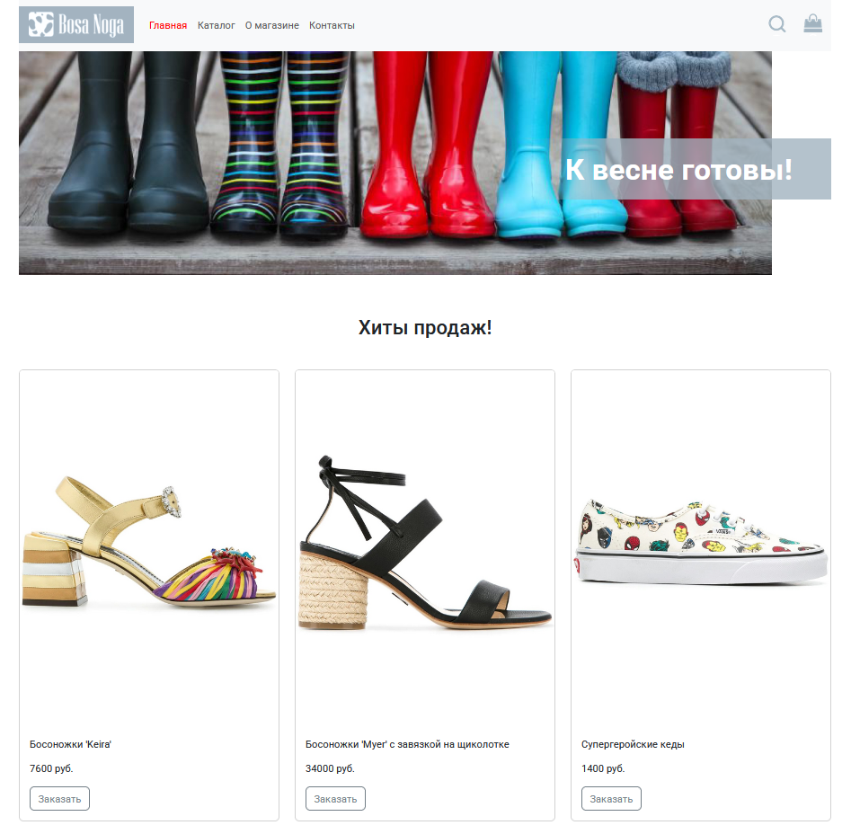
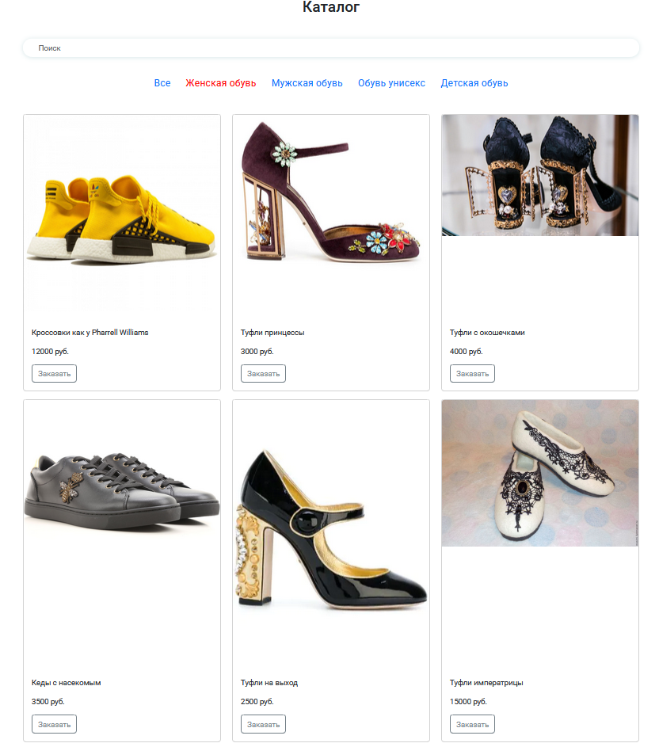
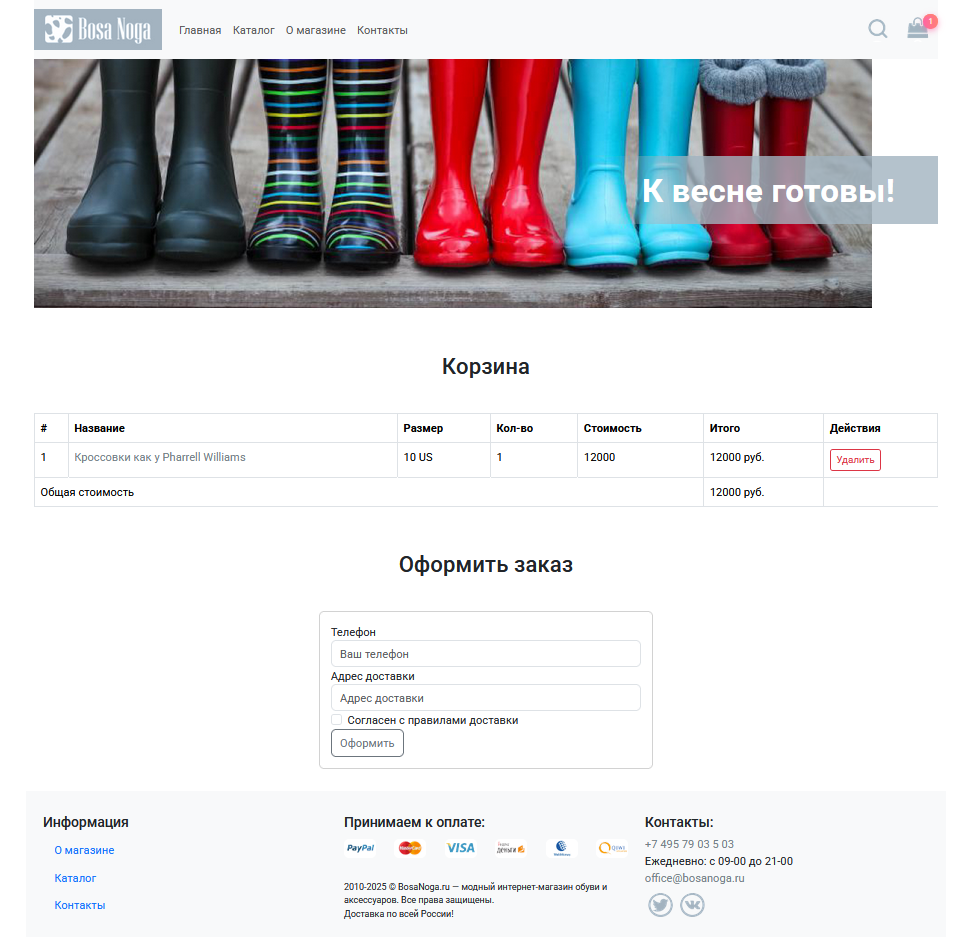

# Онлайн-магазин обуви "Боса Нога"

Проект написан на языке TypeScript с использованием библиотеки React и собран при помощи Vite

Добро пожаловать в репозиторий онлайн-магазина обуви "Боса Нога"! Этот проект представляет собой платформу для продажи обуви, предлагающую пользователям удобный интерфейс для поиска, выбора и покупки обуви различных брендов и моделей.



## Описание проекта

"Боса Нога" — это веб-приложение, которое позволяет пользователям:

-  Просматривать каталог обуви
-  Добавлять товары в корзину
-  Оформлять заказы

**На странице каталога представлены товары различных категорий**



**Страница карточки товара позволяет узнать параметры и выбрать нужный размер**


**Перейдя по иконке в правом верхнем углу можете перейти на страницу корзины выбранных товаров**



## Технологии

Проект разработан с использованием следующих технологий:

-  **Frontend:**

   -  HTML5
   -  CSS3 (с использованием Bootstrap 5.3)
   -  TypeScript 5.7
   -  React 19
   -  React Router 7.2
   -  React Redux 9.2 + Redux-Toolkit 2.5

-  **Backend:**
   -  Node.js 20.18
   -  веб-фреймворка Koa 2.16

## Инструкции по установке и запуску

### Требования

Для работы приложения вам потребуется:

-  Node.js версии 20 или выше
-  npm или yarn

### Установка

1. Клонируйте репозиторий:

```bash
   git clone https://github.com/demargorn/bosa-noga-online-store_react-ts.git
```

2. Переход в каталог проекта:

```bash
   cd bosa-noga
```

3. Установка зависимостей:

```bash
   npm install
```

4. Запуск приложения:

-  запуск frontend-части

```bash
   npm run dev
```

-  запуск backend-части

для этого перейдите в калог \src\backend:

```bash
    cd .\src\backend\
```

запустите сервер:

```bash
    npm run watch
```

Теперь приложение будет доступно по адресу `http://localhost:5173`.

## Функциональность

-  Поиск и фильтрация товаров
-  Страница детального описания товара
-  Корзина покупок
-  Оформление заказа с возможностью доставки

**Спасибо за интерес к нашему проекту! Надеемся, вам понравится использовать онлайн-магазин "Боса Нога".**

## Контакты

Если у вас есть вопросы или предложения, пожалуйста, свяжитесь со мной в Telegram: **@demargorn** или по электронной почте: __demargorn@gmail.com__.
